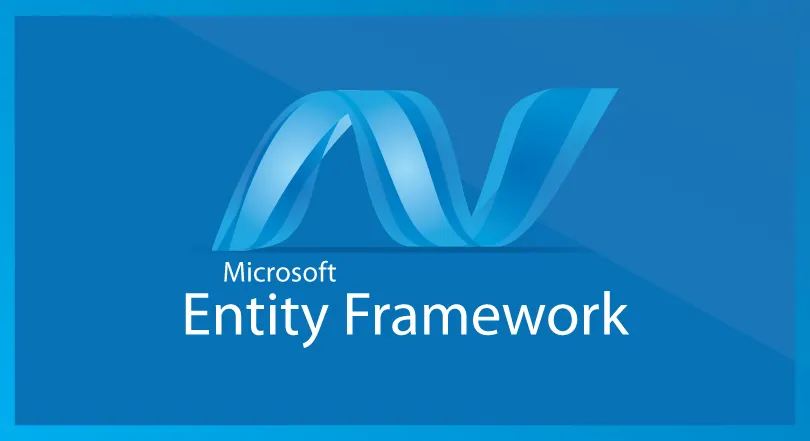
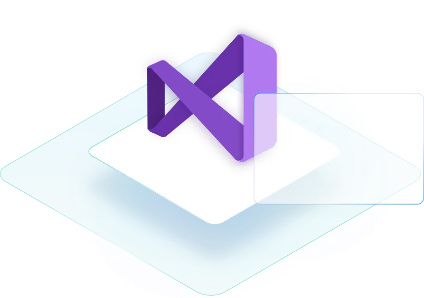

# Hi 👋, I'm Abdul Majid V P

### Full-Stack Developer — .NET Core & React

  <td align="center" width="300"></td>

---

## 👨‍💻 About Me

- 🚀 Full Stack Developer specializing in **ASP.NET Core** backends and **React** frontends
- 🏢 Currently **Full Stack Developer Intern** at **Bridgeon Solutions LLP**, Calicut
- 🧱 Strong advocate of **Clean Architecture**, **SOLID principles**, and maintainable code
- ⚡ Engineered **30+ Web API endpoints** and improved DB performance by **20–30%**
- 🔐 Experienced with **JWT authentication**, role-based authorization, and secure API design
- 📦 Built production-grade e-commerce platforms with **Redux Toolkit**, **EF Core**, and **SQL Server**
- 🎓 **Bachelor of Computer Science (BCA)** — University of Calicut (2022–2025)
- 📫 Reach me at: **majidvp501@gmail.com** | 📱 **+91 7510851668**
- 📍 Palakkad, Mannarkad, Kerala, India
- 💬 Fun fact: I write clean code by day and optimize queries by night! 🌙

---

## 🛠️ Technical Skills

### Backend

<table align="center">
  <tr>
    <td align="center" width="100"> ASP.NET Core</td>
    <td align="center" width="100"> C#</td>
    <td align="center" width="100"> SQL Server</td>
    <td align="center" width="100"> PostgreSQL</td>
    <td align="center" width="100"> Postman</td>
    <td align="center" width="100"> Swagger</td>
  </tr>
  <tr>
    <td align="center" width="100"> Dapper</td>
    <td align="center" width="100"> Entity Framework</td>
    <td align="center" width="100"> ADO.NET</td>
    <td align="center" width="100"> Git</td>
    <td align="center" width="100"> GitHub</td>
    <td align="center" width="100"> REST API</td>

    
    
  </tr>
</table>
---

### Frontend

<table align="center">
  <tr>
    <td align="center" width="100">  React</td>
    <td align="center" width="100"> JavaScript</td>
    <td align="center" width="100"> HTML5</td>
    <td align="center" width="100"> CSS3</td>
    <td align="center" width="100"> Tailwind CSS</td>
  </tr>
  <tr>
    <td align="center" width="100">   Redux</td>
    <td align="center" width="100"> npm</td>
    <td align="center" width="100"> REST API</td>
    <td align="center" width="100"> JWT</td>
    <td align="center" width="100"> VS Code</td>
  </tr>
</table>

---

## 💼 Professional Experience

<table align="center" width="100%">
  <thead>
    <tr>
      <th>Role</th>
      <th>Company</th>
      <th>Duration</th>
      <th>Location</th>
      <th>Focus</th>
    </tr>
  </thead>
  <tbody>
    <tr>
      <td><b>Full Stack Developer Intern</b></td>
      <td>Bridgeon Solutions LLP</td>
      <td>Aug 2025 – Present</td>
      <td>Calicut, Kerala</td>
      <td>ASP.NET Core · React · SQL Server</td>
    </tr>
  </tbody>
</table>

### What I do at Bridgeon Solutions:

- 🔧 Engineered **30+ Web API endpoints** using **ASP.NET Core** and **C#**
- ⚡ Improved database performance by **20–30%** through optimized SQL queries
- 🗄️ Designed and managed **SQL Server** schemas to support complex application features
- 🔗 Integrated backend APIs with **Angular** and **React** components for reliable data flow
- 🎨 Built reusable, responsive UI components using **Angular** and **Tailwind CSS**
- 🔐 Implemented **JWT authentication** to secure backend services and protect API routes

---

## 🚀 Featured Projects

### 🛒 EBoost — E-Commerce Platform for Premium Gaming Gadgets

> A production-grade, full-stack e-commerce platform built with **ASP.NET Core** + **React**

<table>
  <tr>
    <td><b>What it does</b></td>
    <td>Supports products, cart management, orders, wishlists, and admin dashboards</td>
  </tr>
  <tr>
    <td><b>Backend</b></td>
    <td>ASP.NET Core · JWT Auth · Role-based Authorization · SQL Server · EF Core · Swagger</td>
  </tr>
  <tr>
    <td><b>Frontend</b></td>
    <td>React · Redux Toolkit · Tailwind CSS · Responsive Design</td>
  </tr>
  <tr>
    <td><b>Admin</b></td>
    <td>User, product, category, order & inventory management modules</td>
  </tr>
  <tr>
    <td><b>Architecture</b></td>
    <td>Clean Architecture · SOLID Principles · EF Core schema optimization</td>
  </tr>
</table>

---

## 🎓 Education

| Degree | Institution | Year |
|--------|-------------|------|
| **Bachelor of Computer Science (BCA)** | University of Calicut | 2022 – 2025 |

---

## 📊 GitHub Stats

  <!-- GitHub Stats -->
  

  <!-- LeetCode Stats -->
  

  <!-- GitHub Streak -->
  

---

## 🌐 Let's Connect

  <i>"Engineering scalable solutions with clean architecture, one commit at a time." 💻</i>

